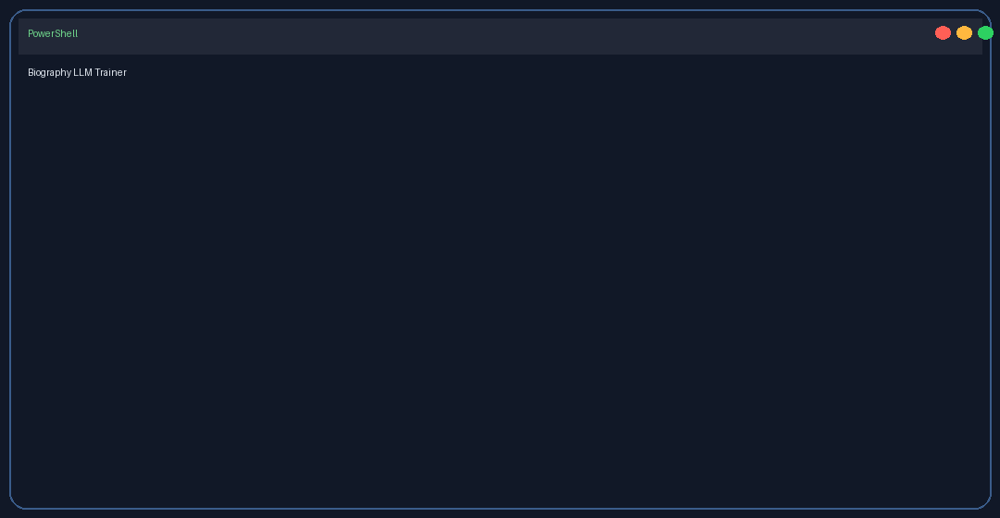
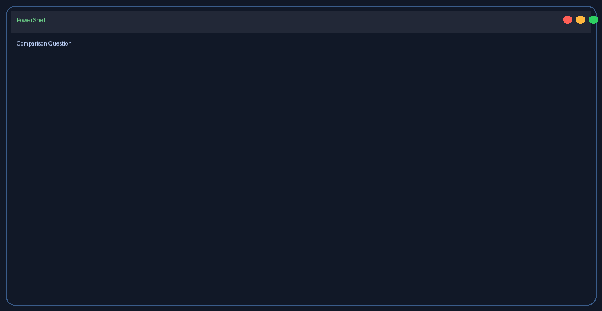

<div align="center">

# 🤖 LLM Fine-Tuning Lab

A simple student-friendly project for training and testing a biography Q&A model.

</div>

---

## ✨ What this project does

- Trains a small instruction-style transformer on biography Q&A examples
- Saves the final model into `output/trained-model`
- Lets you compare the base pretrained model with the fine-tuned version

---

## ✅ Quick start

- Open PowerShell in the project folder
- Confirm Python 3.10+ is installed:

```powershell
python --version
```

- Train the model:

```powershell
python Train_LLM.py
```

- Run the student test lab:

```powershell
python Test_LLM.py
```

- Try one-shot comparison:

```powershell
python Test_LLM.py --question "Where were you born?" --mode compare
```

---

## 🎬 Live demo

### Train workflow



### Test workflow



---

## 📁 Key files

- `Train_LLM.py` — install, train, or clean up the project
- `Test_LLM.py` — student-facing question lab
- `llm_project.py` — shared inference and training helpers
- `data/biography_qa.jsonl` — training examples
- `output/trained-model` — saved fine-tuned model and manifest

---

## 🧪 Helpful commands

- Train and overwrite existing output:

```powershell
python Train_LLM.py --yes --replace_output
```

- Ask a single question:

```powershell
python Test_LLM.py --question "who are you" --mode compare
```

---

## 🛠️ Troubleshooting

If something goes wrong, reset and retry:

```powershell
python Train_LLM.py -Action cleanup
python Train_LLM.py
python Test_LLM.py
```

If the script asks to overwrite output, use:

```powershell
python Train_LLM.py --yes --replace_output
```

---

## 💡 Notes

- The default base model is `HuggingFaceTB/SmolLM2-135M-Instruct`
- The training dataset is in `data/biography_qa.jsonl`
- The final model manifest is written to `output/trained-model`

---

> Built for students: small, repeatable, and easy to run with Python.
